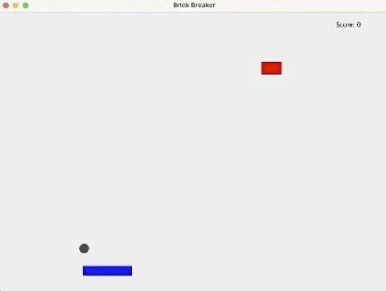

# Brick Breaker with AI Player
**Overview:**
This is a Brick Breaker game implemented in Java. The project features a trained AI that learns to play the game on its own. The AI's training data and learned behaviors are stored in a JSON file, and the best AI plays the game - which is featured in the GUI.
## How It Works
**Game Logic:**
The game involves a paddle, a ball, and a brick that disappears when hit by the ball.
The AI controls the paddle to hit the brick and prevent the ball from falling off the screen.

**AI Training:**
The AI is given four inputs: the x-position of the ball, x-position of the paddle, x-position of the brick, y-position of the brick.
The AI uses this information to hit the brick with the ball and catch the ball with the paddle. 
When the AI is trained, there is a score keeper that tracks the score that increases when the ball hits a brick directly after hitting a paddle, or hits the paddle directly after hitting the brick.
This trains the AI to aim for the bricks and not let the ball fall. The best network is stored in a JSON file.

**AI Gameplay:**
Gets the best network from the JSON file and uses it to play the game.
The GUI is a visual representation of the AI playing Brick Breaker with a single brick that changes positions after being hit.

